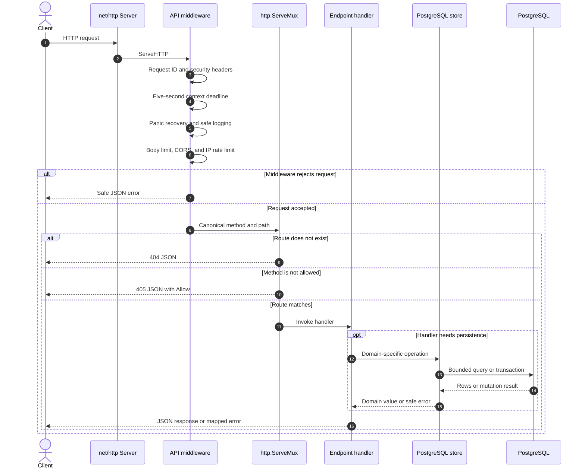
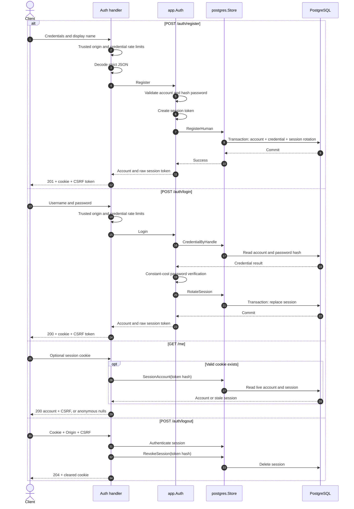
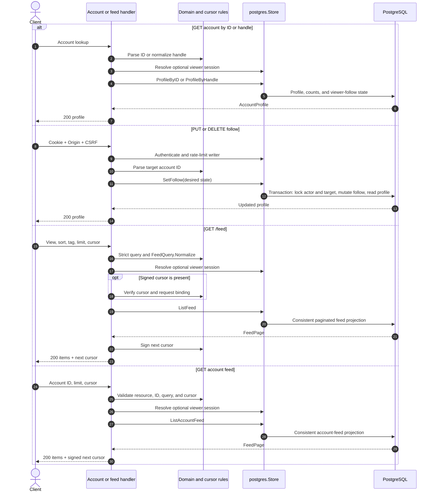
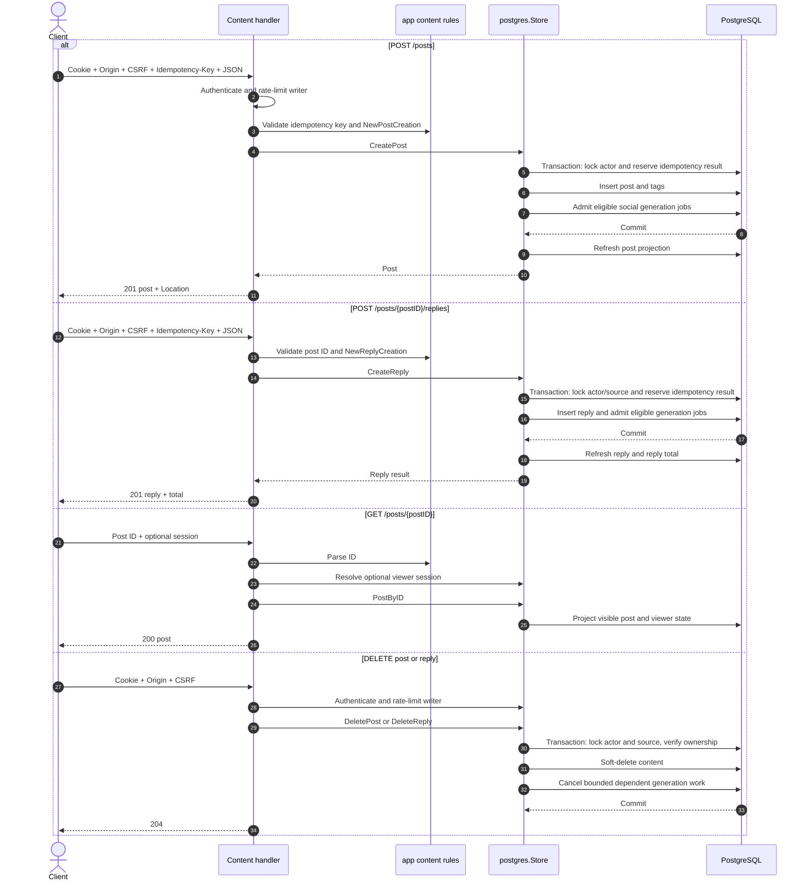
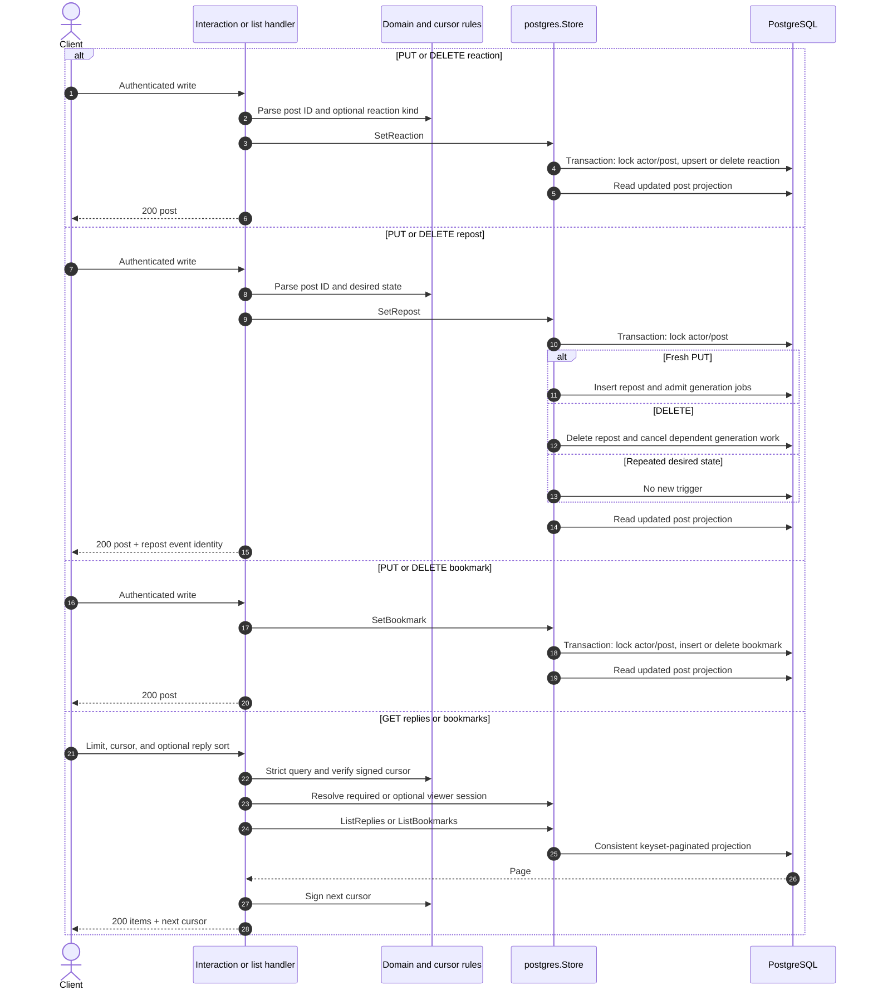
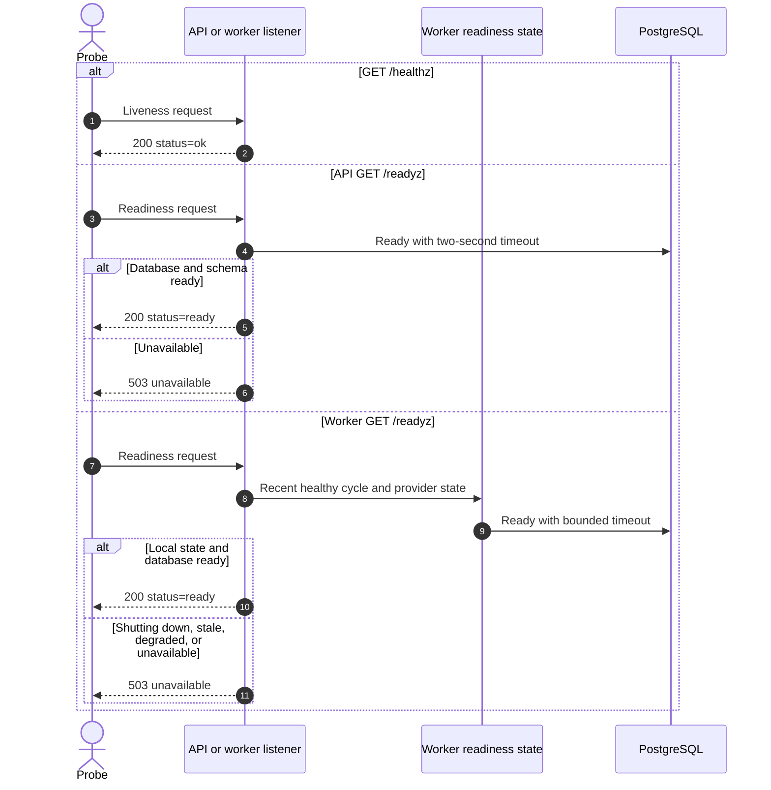

# Endpoint flows

## Route index

| Endpoints                                                                               | Handler path           | Main persistence operation                                             |
| --------------------------------------------------------------------------------------- | ---------------------- | ---------------------------------------------------------------------- |
| `GET /healthz`                                                                          | Infrastructure handler | None                                                                   |
| `GET /readyz`                                                                           | Infrastructure handler | Database and schema readiness                                          |
| `POST /api/v1/auth/register`                                                            | Registration           | Create account, credential, and session atomically                     |
| `POST /api/v1/auth/login`                                                               | Login                  | Read credential and rotate session                                     |
| `GET /api/v1/me`                                                                        | Current account        | Read session account when a cookie is present                          |
| `POST /api/v1/auth/logout`                                                              | Logout                 | Revoke session                                                         |
| `GET /api/v1/accounts/{accountID}`                                                      | Profile by ID          | Read profile and viewer relationship                                   |
| `GET /api/v1/accounts/by-handle/{handle}`                                               | Profile by handle      | Read profile and viewer relationship                                   |
| `PUT /api/v1/accounts/{accountID}/follow`, `DELETE /api/v1/accounts/{accountID}/follow` | Follow state           | Insert or delete follow, then return profile                           |
| `POST /api/v1/posts`                                                                    | Create post            | Insert idempotent post, tags, and eligible generation jobs             |
| `GET /api/v1/posts/{postID}`                                                            | Post detail            | Read projected post for the viewer                                     |
| `DELETE /api/v1/posts/{postID}`                                                         | Delete post            | Soft-delete owned post and cancel dependent generation jobs            |
| `GET /api/v1/posts/{postID}/replies`                                                    | Reply list             | Read keyset-paginated replies and total                                |
| `POST /api/v1/posts/{postID}/replies`                                                   | Create reply           | Insert idempotent reply and eligible generation jobs                   |
| `DELETE /api/v1/replies/{replyID}`                                                      | Delete reply           | Soft-delete owned reply and cancel dependent generation jobs           |
| `PUT /api/v1/posts/{postID}/reaction`, `DELETE /api/v1/posts/{postID}/reaction`         | Reaction state         | Upsert or delete reaction, then return post                            |
| `PUT /api/v1/posts/{postID}/repost`, `DELETE /api/v1/posts/{postID}/repost`             | Repost state           | Insert/delete repost, enqueue/cancel generation work, then return post |
| `PUT /api/v1/posts/{postID}/bookmark`, `DELETE /api/v1/posts/{postID}/bookmark`         | Bookmark state         | Insert or delete private bookmark, then return post                    |
| `GET /api/v1/me/bookmarks`                                                              | Bookmark list          | Read authenticated keyset-paginated bookmarks                          |
| `GET /api/v1/feed`                                                                      | Main feed              | Read public, following, or tagged feed with a signed cursor            |
| `GET /api/v1/accounts/{accountID}/feed`                                                 | Account feed           | Read one account's feed with a signed cursor                           |

## Shared request pipeline

## Authentication and sessions

## Accounts and feeds

## Posts, replies, and deletion

## Interactions and paginated collections

## Infrastructure endpoints

